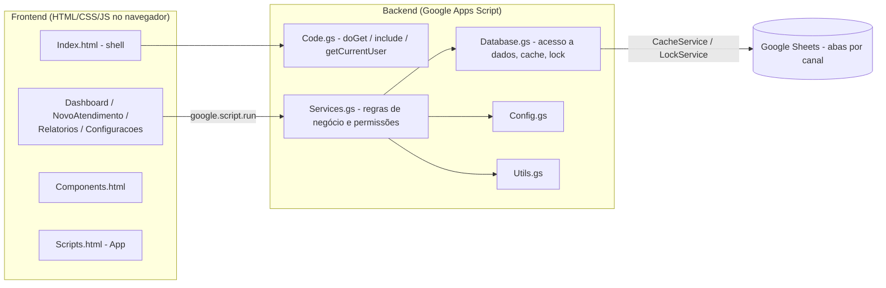

# Sistema RA — Gestão de Atendimentos

## Descrição do projeto

Sistema da célula **RA** para registro, distribuição e acompanhamento das manifestações
recebidas pelos canais **Reclame Aqui**, **Chat Privado do Reclame Aqui** e
**SAC Preventivo**, até a sua conclusão. Permite que analistas cadastrem e acompanhem seus
próprios atendimentos, que supervisores distribuam e reatribuam atendimentos entre a equipe
e que o ADM administre todo o sistema — usuários, campos do formulário e configurações —
tudo com histórico auditável de alterações.

O projeto roda inteiramente na plataforma **Google Apps Script**, usando uma planilha do
**Google Sheets** como banco de dados, sem nenhuma infraestrutura externa.

## Tecnologias

- **Google Apps Script** (JavaScript no servidor, runtime V8)
- **Google Sheets** (persistência dos dados)
- **HTML5 / CSS3 / JavaScript** (frontend, SPA sem frameworks)
- **SheetJS** e **jsPDF** (via CDN, apenas para exportação de relatórios em Excel/PDF)

## Estrutura do projeto

O projeto é "flat" (todos os arquivos na raiz), como exigido pelo Google Apps Script/clasp.

### Backend (`.gs`)

| Arquivo | Responsabilidade |
| --- | --- |
| [Code.gs](Code.gs) | Ponto de entrada do Web App (`doGet`), inclusão de arquivos HTML (`include`), identificação do usuário logado (`getCurrentUser`), menu da planilha (`onOpen`, `abrirSistema`) e funções de setup/manutenção. |
| [Config.gs](Config.gs) | Constantes de configuração (`CONFIG`), colunas de cada aba (`COLUMNS`), listas fixas do fluxo (`STATUS_LIST`, `SITUACOES_PENDENCIA`, `CANAIS_LIST`, `CANAL_SHEETS`) e dados padrão (catálogo e campos do formulário). |
| [Database.gs](Database.gs) | Camada de acesso a dados: leitura/escrita no Google Sheets, cache (`CacheService`), lock de concorrência (`LockService`), inicialização automática das planilhas e migração de dados legados (`migrateLegacyData_`). |
| [Services.gs](Services.gs) | Regras de negócio: CRUD de atendimentos nas abas por canal, alteração rápida de status, timeline/histórico, dashboard, relatórios, configuração dinâmica do formulário e **controle de permissões (ADM x Supervisor x Analista)**. |
| [Utils.gs](Utils.gs) | Utilitários: geração de IDs, validação/formatação de CPF, sanitização de entradas e conversão de dados. |

### Frontend (`.html`)

O frontend é uma SPA montada pelo Apps Script através de
`HtmlService.createTemplateFromFile('Index')`. O [Index.html](Index.html) é a "casca" do
sistema (menu lateral e cabeçalho) e usa `<?!= include('Arquivo') ?>` para colar os demais
arquivos dentro dele, nesta ordem: `Styles` → `Scripts` → `Components` → páginas.

| Arquivo | Responsabilidade |
| --- | --- |
| [Index.html](Index.html) | Casca do sistema: layout e inclusão dos demais arquivos HTML. |
| [Styles.html](Styles.html) | Design system e estilos globais (CSS). |
| [Scripts.html](Scripts.html) | Núcleo do frontend (`App`): navegação entre páginas, usuário logado, helpers compartilhados (datas, CPF, escapeHtml) e visibilidade por perfil (`data-supervisor-only`, `data-admin-only`). |
| [Components.html](Components.html) | Componentes de UI reutilizáveis: modal, toast, badges, tabela, paginação, timeline, KPIs. |
| [Dashboard.html](Dashboard.html) | Página inicial: KPIs gerais, **indicadores e gráficos por canal** e lista de atendimentos com alteração de status direto na tabela. |
| [NovoAtendimento.html](NovoAtendimento.html) | Cadastro e edição de atendimentos com **formulário montado dinamicamente** a partir da aba ConfigCampos. |
| [Relatorios.html](Relatorios.html) | Única tela com filtros; geração de relatórios com exportação (Excel/CSV e PDF) e painel de produtividade. |
| [Configuracoes.html](Configuracoes.html) | Administração de Produtos, Categorias, Usuários e Campos do formulário — acesso restrito por perfil. |

### Outros arquivos

- [appsscript.json](appsscript.json) — manifesto do Apps Script (timezone, escopos OAuth, runtime V8).
- [.clasp.json.example](.clasp.json.example) — modelo para o arquivo `.clasp.json` (não versionado).
- [.claspignore](.claspignore) — define que apenas `*.gs`, `*.html` e `appsscript.json` são sincronizados via clasp.

## Perfis de usuário

O usuário logado é identificado automaticamente via `Session.getActiveUser().getEmail()`
e cruzado com a aba **Usuários** para obter nome e perfil (`getActor_()` em
[Services.gs](Services.gs)). Não há tela de login: o próprio Google Workspace autentica
o usuário ao abrir o Web App. Todas as regras abaixo são aplicadas **no backend**
(`isAdminProfile_`, `isSupervisorProfile_`, `canAccessAtendimento_`,
`restrictToOwnerIfNeeded_`), não apenas escondidas na interface.

### ADM

Acesso total ao sistema:

- Visualiza, cria, edita, exclui e reatribui **qualquer** atendimento.
- Escolhe o analista responsável no cadastro/edição.
- **Gerencia usuários** (criação, perfil, ativação/desativação) — exclusivo do ADM.
- **Configura os campos da tela Novo Atendimento** (aba ConfigCampos) — exclusivo do ADM.
- Administra produtos e categorias e acessa todos os dashboards e relatórios.
- O primeiro usuário do sistema é criado automaticamente como ADM; o sistema impede
  desativar/demover o último ADM ativo.

### Supervisor

Praticamente os mesmos poderes do ADM **em relação aos atendimentos**:

- Visualiza os atendimentos de **todos** os analistas.
- Cria atendimentos e pode **delegá-los a um analista** (campo "Responsável").
- Edita qualquer atendimento e reatribui entre analistas.
- Consulta indicadores e exporta relatórios.
- Administra produtos e categorias.

**Não pode**: gerenciar usuários nem alterar configurações críticas (campos do
formulário). Essas funções permanecem exclusivas do ADM.

### Analista

- Visualiza **apenas** os atendimentos que criou ou dos quais é responsável.
- Cria atendimentos — o **responsável é preenchido automaticamente** com o usuário logado.
- Edita apenas os próprios atendimentos, atualiza status e insere observações.
- Não visualiza atendimentos criados por outros analistas.

## Organização por canais

O campo **Canal** continua existindo no formulário, mas o armazenamento é separado por
abas do Google Sheets — a gravação é automática conforme o canal selecionado:

| Canal selecionado | Aba de gravação |
| --- | --- |
| Reclame Aqui | **ReclameAqui** |
| Chat Privado | **ChatPrivadoRA** |
| SAC Preventivo | **SACPreventivo** |

O **Chat Privado faz parte do Reclame Aqui**, porém possui aba própria para facilitar o
controle operacional. A pesquisa, o dashboard e os relatórios consultam **as três abas
simultaneamente** e apresentam os resultados em uma única lista — o usuário nunca precisa
saber onde os dados estão armazenados. Se o canal de um atendimento for alterado na
edição, o registro é **movido automaticamente** para a aba do novo canal.

## Formulário "Novo Atendimento" configurável

A tela Novo Atendimento não possui estrutura fixa: os campos são montados a partir da aba
**ConfigCampos**, administrada pelo ADM na tela de Configurações → *Campos do formulário*.

| Campo | Exibir | Obrigatório |
| --- | --- | --- |
| Data | Sim | Sim |
| Protocolo | Sim | Sim |
| Nome do cliente | Sim | Sim |
| CPF | Sim | Sim |
| Produto | Sim | Não |
| Categoria | Sim | Não |
| Canal | Sim | Sim |
| Observações | Sim | Não |
| Agência | Não | Não |

O ADM pode:

- **Adicionar campos novos** (texto, data, número ou texto longo) — os valores são
  gravados na coluna `CamposExtras` (JSON) da aba do canal, sem alterar o esquema;
- **Ocultar** campos (desmarcar "Exibir") e **definir obrigatoriedade**;
- **Reordenar** os campos (coluna Ordem).

Nenhuma alteração de código é necessária para adicionar ou remover campos. O **Canal** é
um campo bloqueado (sempre exibido e obrigatório), pois define a aba de gravação. A
validação de obrigatoriedade é aplicada no navegador **e** no servidor, a partir da mesma
configuração.

## Fluxo do atendimento

Status fixos do fluxo: **Pendente**, **Em análise** e **Concluído**.

1. **Cadastro** — o formulário é montado conforme a ConfigCampos. CPF é validado e o
   protocolo tem duplicidade verificada em tempo real (nas três abas de canal).
2. **Status "Pendente"** — o campo **"Aguardando Retorno de"** aparece e passa a ser
   obrigatório, com duas opções: **Área** ou **Cliente**.
3. **Status "Em análise" ou "Concluído"** — o campo "Aguardando Retorno de" fica oculto.
   Ao concluir, data e tempo de resolução são calculados automaticamente.
4. **Acompanhamento** — pelo Dashboard, o usuário altera o status/situação diretamente na
   tabela, sem abrir o formulário.
5. **Timeline e Histórico** — toda criação, delegação, mudança de status ou edição gera um
   evento na Timeline e, quando altera um campo, uma linha imutável no Histórico
   (com justificativa obrigatória em edições pelo formulário).
6. **Relatórios** — única tela com filtros (período, analista, produto, categoria, status,
   aguardando retorno, canal, protocolo, cliente e CPF), com exportação Excel/CSV e PDF e
   painel de produtividade por analista.
7. **Exclusão** — é lógica (campo `Excluido`), preservando o histórico para auditoria.

## Dashboard

Os indicadores consideram simultaneamente as abas **ReclameAqui**, **ChatPrivadoRA** e
**SACPreventivo**:

- KPIs gerais: total, pendentes, em análise, concluídos e pendências por
  "Aguardando Retorno de" (Área/Cliente);
- **Gráficos separados por canal**: total, pendentes, em análise e concluídos de cada
  canal, com barras proporcionais.

## Estrutura do banco de dados (abas do Google Sheets)

Todas as abas são criadas e mantidas automaticamente por `initializeSheets()` (em
[Database.gs](Database.gs)), com base nas definições de [Config.gs](Config.gs).

| Aba | Conteúdo |
| --- | --- |
| **ReclameAqui / ChatPrivadoRA / SACPreventivo** | Atendimentos de cada canal (protocolo, cliente, CPF, produto, categoria, canal, status, aguardando retorno, responsável, datas, observações, campos extras e auditoria de criação/exclusão). As três abas compartilham o mesmo conjunto de colunas. |
| **ConfigCampos** | Configuração dinâmica do formulário Novo Atendimento (campo, rótulo, tipo, exibir, obrigatório, ordem). |
| **Timeline** | Eventos cronológicos de cada atendimento (criação, mudança de status, delegação, observações, exclusão). |
| **Histórico** | Registro imutável (somente inserção) de toda alteração de campo, com valor anterior/novo, usuário e justificativa. |
| **Usuários** | Cadastro de usuários (nome, e-mail, perfil ADM/Supervisor/Analista, equipe, status). |
| **Produtos / Categorias** | Listas administráveis usadas para classificar atendimentos. |

Instalações antigas são migradas automaticamente na primeira execução: os atendimentos da
aba legada `Atendimentos` são movidos para a aba do seu canal, os status antigos são
normalizados para o novo fluxo (Pendente / Em análise / Concluído + Área/Cliente) e o
primeiro supervisor ativo é promovido a ADM.

## Como executar / publicar

### Pré-requisitos

```
npm install -g @google/clasp
clasp login
```

### Clonar/associar um projeto existente

```
clasp clone <SCRIPT_ID>
```

Ou, para um projeto novo, copie [.clasp.json.example](.clasp.json.example) para `.clasp.json`
e preencha o `scriptId` do seu projeto Apps Script.

### Enviar/trazer alterações

```
clasp push   # envia o código para o Apps Script
clasp pull   # traz alterações feitas no editor online
```

### Publicar (implantar como Web App)

1. `clasp push` para enviar o código mais recente.
2. `clasp deploy` (ou pelo editor: **Implantar → Nova implantação → Aplicativo da Web**).
3. Configurar a implantação com:
   - **Executar como:** Usuário que acessa o aplicativo da Web (necessário para que
     `Session.getActiveUser()` identifique corretamente cada usuário e perfil).
   - **Quem pode acessar:** restrito à organização (nunca "Qualquer pessoa").
4. Acessar a URL do Web App gerada.

Ao abrir a URL, o sistema inicializa automaticamente as planilhas (`ensureDatabaseReady`)
e executa as migrações pendentes.

## Arquitetura



- O navegador nunca acessa o Google Sheets diretamente: toda comunicação passa por
  `google.script.run` chamando funções públicas de [Services.gs](Services.gs).
- [Services.gs](Services.gs) aplica as regras de negócio e permissão, e delega leitura/escrita
  para [Database.gs](Database.gs), que usa `CacheService` (performance) e `LockService`
  (concorrência segura) antes de tocar na planilha.

## Performance

- **Uma chamada por tela**: o Dashboard carrega KPIs + indicadores por canal + lista de
  atendimentos em uma única requisição (`getDashboardData`), e os dados de apoio dos
  formulários/filtros vêm de uma única chamada na inicialização (`getBootstrapData`).
- **Cache**: leituras de planilha passam pelo `CacheService` (5 min), invalidado a cada escrita.
- **Escritas atômicas**: a verificação de protocolo duplicado e a gravação acontecem sob o
  mesmo `LockService`, nas três abas de canal.
- **Skeletons em vez de overlay**: as telas mostram esqueletos de carregamento e mantêm a
  interface responsiva; o overlay bloqueante é usado apenas em gravações.

## Observações de segurança

- Identificação do usuário via `Session.getActiveUser().getEmail()`.
- Validação de permissão (ADM/Supervisor/Analista) aplicada no backend, não apenas na interface.
- Gestão de usuários e dos campos do formulário exigem perfil ADM no servidor (`requireAdmin_`).
- Histórico (`Histórico`) é somente-inserção, sem exclusão.
- Exclusão de atendimentos é lógica (mantém rastro para auditoria).
- Entradas sanitizadas no servidor (`sanitizeInput`) e HTML escapado no cliente (`App.escapeHtml`).
- Ao implantar, configure o Web App para **não** liberar acesso anônimo — restrinja à
  organização/domínio.
