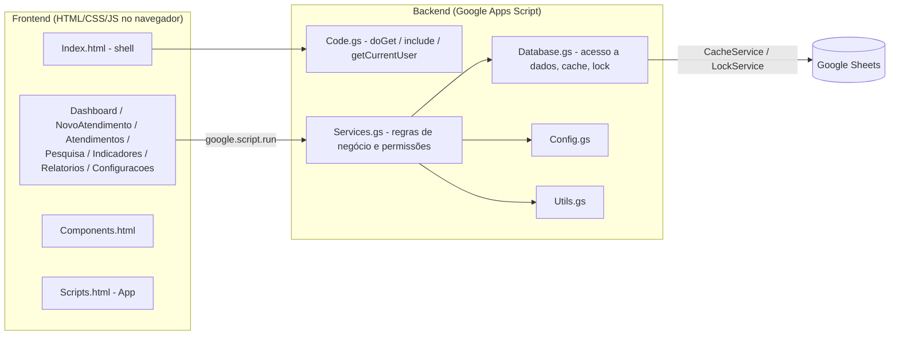

# PortoBank Reclame Aqui — Sistema de Gestão de Atendimentos

## Descrição do projeto

Sistema corporativo para gestão dos atendimentos recebidos via **Reclame Aqui** (e canais
relacionados: Consumidor.gov, Procon, Bacen, Susep, ANS, Judicial, Ouvidoria) da Porto. Permite
que analistas cadastrem e acompanhem seus atendimentos, e que supervisores tenham visão e
controle completos sobre toda a operação, com histórico auditável de todas as alterações.

O projeto roda inteiramente na plataforma **Google Apps Script**, usando uma planilha do
**Google Sheets** como banco de dados, sem nenhuma infraestrutura externa.

## Tecnologias

- **Google Apps Script** (JavaScript no servidor, runtime V8)
- **Google Sheets** (persistência dos dados)
- **HTML5 / CSS3** (interface)
- **JavaScript** (frontend, SPA sem frameworks)

## Estrutura do projeto

O projeto é "flat" (todos os arquivos na raiz), como exigido pelo Google Apps Script/clasp.

### Backend (`.gs`)

| Arquivo | Responsabilidade |
| --- | --- |
| [Code.gs](Code.gs) | Ponto de entrada do Web App (`doGet`), inclusão de arquivos HTML (`include`), identificação do usuário logado (`getCurrentUser`), menu da planilha (`onOpen`, `abrirSistema`) e funções de setup/manutenção. |
| [Config.gs](Config.gs) | Constantes de configuração (`CONFIG`), definição das colunas de cada aba (`COLUMNS`) e dados padrão inseridos na primeira execução (status, prioridades, canais, produtos, categorias, "pendente com" etc.). |
| [Database.gs](Database.gs) | Camada de acesso a dados: leitura/escrita no Google Sheets, cache (`CacheService`), lock de concorrência (`LockService`) e inicialização automática das planilhas. |
| [Services.gs](Services.gs) | Regras de negócio: CRUD de atendimentos, cálculo de SLA, timeline/histórico, dashboard, indicadores, relatórios, configurações administráveis e **controle de permissões (Analista x Supervisor)**. |
| [Utils.gs](Utils.gs) | Utilitários: geração de IDs, formatação de datas, validação de CPF, cálculo de horas úteis e sanitização de entradas. |

### Frontend (`.html`)

O frontend é uma SPA (Single Page Application) montada pelo Apps Script através de
`HtmlService.createTemplateFromFile('Index')`. O [Index.html](Index.html) é a "casca" do
sistema (menu lateral, cabeçalho, barra de filtros) e usa `<?!= include('Arquivo') ?>` para
colar os demais arquivos dentro dele, nesta ordem: `Styles` → `Scripts` → `Components` →
páginas.

| Arquivo | Responsabilidade |
| --- | --- |
| [Index.html](Index.html) | Casca do sistema: monta o layout e inclui todos os demais arquivos HTML. |
| [Styles.html](Styles.html) | Design system e estilos globais (CSS). |
| [Scripts.html](Scripts.html) | Núcleo do frontend (`App`): navegação entre páginas, filtros globais, relógio, máscara de CPF e visibilidade por perfil (`applyRoleVisibility`). |
| [Components.html](Components.html) | Componentes de UI reutilizáveis: modal, toast, badges, tabela, paginação, timeline, KPIs. |
| [Dashboard.html](Dashboard.html) | Página inicial com indicadores resumidos e alertas. |
| [NovoAtendimento.html](NovoAtendimento.html) | Cadastro e edição de atendimentos (ver campos abaixo). |
| [Atendimentos.html](Atendimentos.html) | Listagem operacional de atendimentos (tabela, paginação, exportação). |
| [Pesquisa.html](Pesquisa.html) | Pesquisa avançada de atendimentos. |
| [Indicadores.html](Indicadores.html) | Gráficos (Chart.js) com indicadores operacionais. |
| [Relatorios.html](Relatorios.html) | Geração de relatórios com exportação (Excel/CSV). |
| [Configuracoes.html](Configuracoes.html) | Administração das listas do sistema (produtos, categorias, status, canais, usuários etc.) — acesso restrito a Supervisores. |

### Outros arquivos

- [appsscript.json](appsscript.json) — manifesto do Apps Script (timezone, escopos OAuth, runtime V8).
- [.clasp.json.example](.clasp.json.example) — modelo para o arquivo `.clasp.json` (não versionado).
- [.claspignore](.claspignore) — define que apenas `*.gs`, `*.html` e `appsscript.json` são sincronizados via clasp.

## Como executar

### Pré-requisitos

```
npm install -g @google/clasp
clasp login
```

### Clonar/associar um projeto existente

```
clasp clone <SCRIPT_ID>
```

Ou, para um projeto novo, copie [.clasp.json.example](.clasp.json.example) para `.clasp.json`
e preencha o `scriptId` do seu projeto Apps Script.

### Enviar alterações para o Apps Script

```
clasp push
```

### Trazer alterações feitas no editor online

```
clasp pull
```

### Publicar (implantar como Web App)

1. `clasp push` para enviar o código mais recente.
2. `clasp deploy` (ou pelo editor: **Implantar → Nova implantação → Aplicativo da Web**).
3. Configurar a implantação com:
   - **Executar como:** Usuário que acessa o aplicativo da Web (necessário para que
     `Session.getActiveUser()` identifique corretamente cada analista/supervisor).
   - **Quem pode acessar:** restrito à organização (nunca "Qualquer pessoa", para não expor
     dados de clientes).
4. Acessar a URL do Web App gerada.

### Executar

- Ao abrir a URL do Web App, o sistema inicializa automaticamente as planilhas necessárias
  (`ensureDatabaseReady`), caso ainda não existam.
- Alternativamente, dentro da planilha vinculada, use o menu **PortoBank Reclame Aqui → Abrir
  Sistema** (criado por `onOpen`/`abrirSistema` em [Code.gs](Code.gs)).
- Para forçar a criação/atualização das planilhas manualmente, execute a função `setup()` pelo
  editor do Apps Script.

## Estrutura do banco de dados

Todas as abas são criadas e mantidas automaticamente por `initializeSheets()` (em
[Database.gs](Database.gs)), com base nas definições de [Config.gs](Config.gs).

| Aba | Conteúdo |
| --- | --- |
| **Atendimentos** | Registro principal de cada atendimento (protocolo, cliente, CPF, status, "pendente com", responsável, datas, SLA, observações, auditoria de criação/exclusão). |
| **Timeline** | Eventos cronológicos de cada atendimento (criação, mudança de status, espera iniciada/finalizada, observações). |
| **Histórico** | Registro imutável (somente inserção) de toda alteração de campo, com valor anterior/novo, usuário e justificativa. |
| **Usuários** | Cadastro de analistas e supervisores (nome, e-mail, perfil, equipe, status). |
| **Produtos / Categorias** | Listas administráveis usadas para classificar atendimentos e calcular SLA. |
| **Status** | Status possíveis (**Em análise**, **Finalizado**) e o "Tipo" que rege o comportamento de SLA (Espera/Final). |
| **Prioridades** | Níveis de prioridade e multiplicador de SLA. |
| **Canais** | Canais de entrada (Reclame Aqui, Consumidor.gov, Procon, Bacen, Susep, ANS, Judicial, Ouvidoria). |
| **TiposAtendimento** | Tipos de atendimento (Reclamação, Solicitação, Contestação, Elogio). |
| **SLAs** | Regras específicas de SLA por produto/categoria/canal/tipo. |
| **MotivosPendencia** | Valores de "Pendente com" (**Área**, **Cliente**), usados apenas quando o Status é "Em análise". |
| **Dashboard** | Snapshot dos indicadores mais recentes. |
| **Relatórios** | Log de relatórios gerados (filtros usados, quantidade, quem gerou). |
| **Configurações** | Parâmetros operacionais editáveis (SLA padrão, limites de alerta, horário comercial). |

## Controle de usuários

O usuário logado é identificado automaticamente via `Session.getActiveUser().getEmail()`
(a forma mais compatível com o Google Apps Script) e cruzado com a aba **Usuários** para
obter nome e perfil (`getActor_()` em [Services.gs](Services.gs)). Não há tela de login: o
próprio Google Workspace autentica o usuário ao abrir o Web App.

### Perfil Analista

- Não escolhe responsável: o sistema identifica automaticamente quem criou o atendimento.
- Visualiza apenas os atendimentos dos quais é responsável/criador.
- Só pode editar ou excluir os próprios atendimentos.
- Essas regras são aplicadas **no backend** (`canAccessAtendimento_`, `restrictToOwnerIfNeeded_`
  em [Services.gs](Services.gs)), não apenas escondidas na interface — uma tentativa de acessar
  um atendimento de outro analista é bloqueada mesmo chamando a função diretamente.

### Perfil Supervisor

- Visualiza todos os atendimentos, de todos os analistas.
- Pode editar ou excluir qualquer atendimento.
- Pode escolher o analista responsável através de um campo de seleção (visível apenas para
  este perfil em [NovoAtendimento.html](NovoAtendimento.html)).
- É o único perfil com acesso à tela de **Configurações**.

## Fluxo do atendimento

1. **Cadastro** — o analista (ou supervisor) preenche o formulário em **Novo Atendimento**
   com: Data, Protocolo, Nome, CPF, Status e Observações.
2. **Status "Em análise"** — ao selecionar este status, o campo **Pendente com** (Área ou
   Cliente) aparece e passa a ser obrigatório, indicando com quem o atendimento está pendente.
3. **Status "Finalizado"** — o campo **Pendente com** é ocultado automaticamente e o
   atendimento é marcado como encerrado (data e tempo de resolução calculados).
4. **Timeline e Histórico** — toda criação, mudança de status ou edição gera um evento na
   Timeline e, quando altera um campo, uma linha imutável no Histórico (com justificativa
   obrigatória em edições).
5. **Consulta** — o atendimento aparece nas telas de Dashboard, Atendimentos, Pesquisa,
   Indicadores e Relatórios, sempre respeitando a regra de permissão (Analista vê só os seus;
   Supervisor vê todos).
6. **Exclusão** — é lógica (campo `Excluido`), preservando o histórico para auditoria.

## Arquitetura



- O navegador nunca acessa o Google Sheets diretamente: toda comunicação passa por
  `google.script.run` chamando funções públicas de [Services.gs](Services.gs).
- [Services.gs](Services.gs) aplica as regras de negócio e permissão, e delega leitura/escrita
  para [Database.gs](Database.gs), que usa `CacheService` (performance) e `LockService`
  (concorrência segura) antes de tocar na planilha.
- [Config.gs](Config.gs) e [Utils.gs](Utils.gs) são bibliotecas de apoio usadas pelas outras
  camadas (constantes, colunas e funções utilitárias sem estado).

## Compatibilidade

O projeto usa exclusivamente APIs nativas do Google Apps Script — não há bibliotecas de
backend externas:

- `HtmlService` (`createTemplateFromFile`, `include`, `createHtmlOutputFromFile`)
- `SpreadsheetApp`
- `Session` (identificação do usuário)
- `CacheService`
- `LockService`
- `PropertiesService`

No frontend, os únicos recursos externos carregados são a fonte de ícones do Google
(Material Icons) e a biblioteca **Chart.js** (via CDN, apenas para os gráficos de
Indicadores) — ambos referenciados em [Index.html](Index.html).

## Observações de segurança

- Identificação do usuário via `Session.getActiveUser().getEmail()`.
- Validação de permissão (Analista/Supervisor) aplicada no backend, não apenas na interface.
- Histórico (`Histórico`) é somente-inserção, sem exclusão.
- Exclusão de atendimentos é lógica (mantém rastro para auditoria).
- Ao implantar, configure o Web App para **não** liberar acesso anônimo — restrinja a
  organização/domínio.
